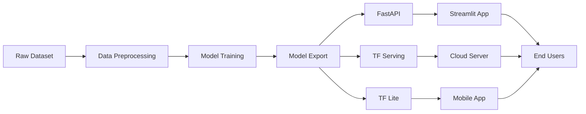

# Potato Disease Detection System

https://www.linkedin.com/feed/update/urn:li:activity:7347185551906680850/

[](https://python.org)
[](https://tensorflow.org)
[](https://fastapi.tiangolo.com)
[](https://streamlit.io)
[](LICENSE)

> **AI-Powered Disease Detection for Farmers** 
> An end-to-end machine learning system that helps farmers identify potato diseases instantly using computer vision.

**Author:** Surakiat Kansa-ard | ML Engineer

---

## **Project Overview**

This project implements a comprehensive AI solution for potato disease detection, enabling farmers to identify diseases in potato plants through simple photo uploads. The system achieves **97.4% validation accuracy** and **96.88% test accuracy** in detecting Early Blight, Late Blight, and Healthy plants.

### **Key Features**
- **Instant Detection** - Upload a photo, get results in seconds
- **High Accuracy** - 95%+ accuracy on validation data
- **Mobile-Friendly** - Optimized for field use on smartphones
- **Treatment Recommendations** - Comprehensive care instructions
- **Multiple Deployment Options** - Cloud, Edge, and Mobile
- **Real-time API** - RESTful endpoints for integration

---

## **System Architecture**



### **Components:**
1. **Data Pipeline**: TensorFlow Dataset + Augmentation
2. **Model**: Custom CNN with transfer learning
3. **Serving**: Multi-platform deployment (TF Serving, TF Lite, FastAPI)
4. **Frontend**: Streamlit web application
5. **API**: RESTful endpoints for integration

---

## **Technical Details**

### **Model Architecture**
- **Base Model**: Custom CNN with transfer learning
- **Input**: 256x256 RGB images
- **Output**: 3 classes (Early Blight, Late Blight, Healthy)
- **Framework**: TensorFlow/Keras
- **Test Accuracy**: 96.88%
- **Validation Accuracy**: 97.40%
- **Training Accuracy**: 98.96%

### **Dataset**
- **Source**: PlantVillage Dataset
- **Images**: 2,152 potato leaf images
- **Classes**: 
  - Early Blight: 1,000 images
  - Late Blight: 1,000 images  
  - Healthy: 152 images
- **Preprocessing**: Resize, normalize, augmentation

### **Deployment Options**
- **Web App**: Streamlit interface
- **API Server**: FastAPI with automatic docs
- **Cloud**: TensorFlow Serving
- **Mobile**: TensorFlow Lite

---

## **Project Structure**

```
POTATO-DISEASE-DETECTION/
├── api/                             # FastAPI Backend
│   ├── main.py                      # API server
│   ├── gateway.py                   # API gateway
│   └── requirements.txt             # Backend dependencies
│
├── models/                          # Trained Models
│   ├── potato_model_v1.keras        # Model version 1
│   └── potato_model_v2.keras        # Latest model
│
├── notebooks/                       # Development Notebooks
│   └── training_notebook.ipynb      # Model training & experiments
│
├── PlantVillageData/                # Training Dataset
│   ├── Potato___Early_blight/       # Early blight images
│   ├── Potato___Late_blight/        # Late blight images
│   └── Potato___healthy/            # Healthy plant images
│
├── tf_serving/                      # TensorFlow Serving
│   ├── models/                      # Serving models
│   ├── docker-compose.yml           # Docker configuration
│   └── export_model.py              # Model export script
│
├── tf_lite/                         # Mobile Deployment
│   └── convert_to_tflite.py         # TF Lite conversion
│
├── streamlit_app.py              # Web Application
├── requirements.txt              # Dependencies
├── Dockerfile                    # Container configuration
└── README.md                      
```

---

## **Quick Start**

### **Prerequisites**
```bash
Python 3.8+
pip or conda
```

### **Installation**
```bash
# Clone repository
git clone https://github.com/your-username/potato-disease-detection.git
cd potato-disease-detection

# Install dependencies
pip install -r requirements.txt
```

### **Running the Application**

#### **Option 1: Web Application**
```bash
# Start the web app
streamlit run streamlit_app.py

# Open browser: http://localhost:8501
```

#### **Option 2: API Server**
```bash
# Start API server
cd api
python main.py

# API docs: http://localhost:8000/docs
```

#### **Option 3: Docker Deployment**
```bash
# Build and run with Docker
docker-compose up --build

# Access at: http://localhost:8501
```

---

## **Usage**

### **Web Interface**
1. Open the Streamlit app
2. Upload a potato leaf image
3. Click "Analyze Disease"
4. View results with confidence scores
5. Read treatment recommendations

### **API Usage**
```python
import requests

# Upload image for prediction
files = {"file": open("potato_leaf.jpg", "rb")}
response = requests.post("http://localhost:8000/predict", files=files)
result = response.json()

print(f"Disease: {result['predicted_class']}")
print(f"Confidence: {result['confidence']:.2%}")
```

### **Model Training**
```bash
# Train new model
python train_model.py

# Export for serving
python tf_serving/export_model.py

# Convert to TF Lite
python tf_lite/convert_to_tflite.py
```

---

## **Model Performance**

### **Overall Performance**
| Metric | Training | Validation | Test |
|--------|----------|------------|------|
| **Accuracy** | 98.96% | 97.40% | 96.88% |

### **Detailed Classification Report**
| Class | Precision | Recall | F1-Score | Support |
|-------|-----------|--------|----------|---------|
| **Early Blight** | 0.99 | 0.96 | 0.98 | 124 |
| **Late Blight** | 0.94 | 0.99 | 0.96 | 111 |
| **Healthy** | 1.00 | 0.90 | 0.95 | 21 |
| **Macro Avg** | 0.98 | 0.95 | 0.96 | 256 |
| **Weighted Avg** | 0.97 | 0.97 | 0.97 | 256 |

### **Key Achievements**
- **Excellent Precision**: 99% for Early Blight detection
- **High Recall**: 99% for Late Blight detection  
- **Perfect Precision**: 100% for Healthy plant identification
- **Robust Performance**: Consistent across all disease types

---

## **Technology Stack**

### **Machine Learning**
- **TensorFlow 2.x** - Deep learning framework
- **Keras** - High-level neural networks API
- **OpenCV** - Image processing
- **NumPy/Pandas** - Data manipulation

### **Backend**
- **FastAPI** - Modern, fast web framework
- **Uvicorn** - ASGI server
- **Pillow** - Image processing
- **TensorFlow Serving** - Model serving

### **Frontend**
- **Streamlit** - Web app framework
- **Plotly** - Interactive visualizations
- **HTML/CSS** - Custom styling

### **Deployment**
- **Docker** - Containerization
- **TensorFlow Lite** - Mobile deployment
- **Nginx** - Reverse proxy (production)

---

## **Impact & Applications**

### **For Farmers**
- **Early Disease Detection** - Prevent crop loss
- **Accurate Diagnosis** - Proper treatment selection
- **Cost Reduction** - Minimize pesticide waste
- **Mobile Accessibility** - Works in the field

### **For Agriculture Industry**
- **Crop Yield Improvement**
- **Economic Benefits**
- **Sustainable Farming**
- **Educational Tool**

---

## **Future Enhancements**

- [ ] **Multi-crop Support** - Extend to other vegetables
- [ ] **Disease Progression Tracking** - Time-series analysis
- [ ] **IoT Integration** - Automated monitoring systems
- [ ] **Multilingual Support** - Local language interfaces
- [ ] **Offline Capability** - Edge deployment optimization
- [ ] **Expert System** - Advanced treatment recommendations

---

## **Contributing**

Contributions are welcome! Please feel free to submit a Pull Request.

1. Fork the project
2. Create your feature branch (`git checkout -b feature/AmazingFeature`)
3. Commit your changes (`git commit -m 'Add some AmazingFeature'`)
4. Push to the branch (`git push origin feature/AmazingFeature`)
5. Open a Pull Request

---

## **License**

This project is licensed under the MIT License - see the [LICENSE](LICENSE) file for details.

---

## **Author**

**Surakiat Kansa-ard**  
*Machine Learning Engineer*

- **GitHub**: [github.com/SurakiatP](https://github.com/SurakiatP)
- **Email**: [surakiat.0723@gmail.com](mailto:surakiat.0723@gmail.com)
- **LinkedIn**: [[Connect with me on LinkedIn](https://www.linkedin.com/in/surakiat-kansa-ard-171942351/)]

---

## **Acknowledgments**

- **PlantVillage** for providing the dataset
- **TensorFlow Team** for the amazing framework
- **Streamlit** for the intuitive web framework
- **Agricultural community** for inspiration and feedback

---

## **References**

1. PlantVillage Dataset - [Link to dataset]
2. TensorFlow Documentation - [tensorflow.org](https://tensorflow.org)
3. Agricultural Disease Research Papers - [Citations]

---

** If this project helped you, please give it a star!**
